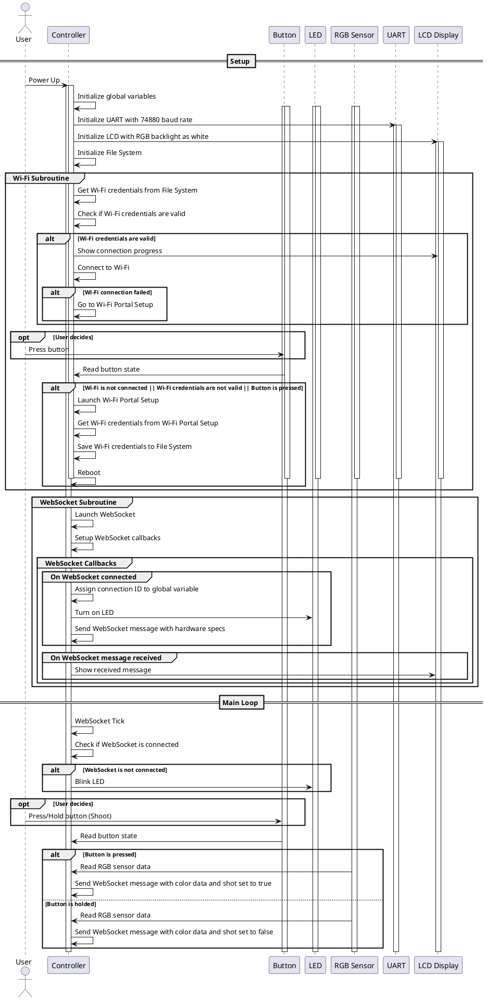

# QuackHunt Gun Logic

<!---

-->

![Gun Logic](https://www.plantuml.com/plantuml/dsvg/pLL1Roid4BxlhnZbr1wYzb2fJrLTlHUxBusKgfKtKOyL2-DTP0mhcBMLAZ--i3YBsUBOogcMekp0pCV7D_3nsH6pDEmKt0yQ7aqhULKnJiR2pRD3UmFCmU0_gjxdIIvxfWbkbaQJDKeT4_WKvcbt0v7HOqepVkRJZx-knZc58fzOtzz1ZTgP26_RvcyNmXdyyvVrKoJeHsVGonMifEiLUubBS55LYuL7fQ67nQ8AUuBRNqwe_mH_ceCVVEw307BF24zcYsFfSmxre2L9fkG_2Aqo3LEmPrQoHg5BI56Jyt7GfHmaHOfZEQ-WJiOew0O7IHty-CEdJzz3mmO1rcCai52JHpbe43J3z897oD2xXl6jacr7GVf39q-GGs4UN2NYLwaGwXT7kAjQQtmF_vAtNoNKG-CZaXehyB_pMFT8nn9kKQ0Em0usrkmoxFT1bXtoBSXD0ObPX3rJKemGJD75dF0hQ5ftvX36DNAIHaDlJMlHkRocJ2zM0PcuU2p9wIJW3PCA4vKByfa9rLyJIqp5gpILemvGwR_f2OA1W40k1IRwRnSl7dP_wSBcZb52oCdyV3kbhv69Om2E6E5CR-b06thR9mfuVIrt8gJ5ReIKw5IXkWzyK5mXzoCRDE_EY_B1u_WXl9hjiG189Z_T5t7Ms1X3KwB0WhsKPXMAqd1iLB605mk2qvJ64yVfZ8I_enLWKnk-HRhU3cBlKkM5z1efMuSpfOB9nMCzPx7CPbF67pebfHDwvGtyufnizUa5VbW1cVdpyWwQGcylJuFLu8lzstlbmZLgSS9xXywn5gFPTyoAGxXChaVkCZCeRZs7iCXHxWiA52nnIdwhBZeFwlZC_ywatw8nurD_Vck9qfFas-eAuqyLqfsqa2dAfd8Fgixquav9lGsT67aN7RFebj_zPjHaWjzuTGnzEq9SQvc1RjdnSeHqvoFA-BZ70H2CMFNnayEDEe80yrckC-IHnxUBx80LAeSd73kZnF-8ueOfXwFaPOUSEUD_7N7cX7C7B3jVzHcr67RgNm00)
