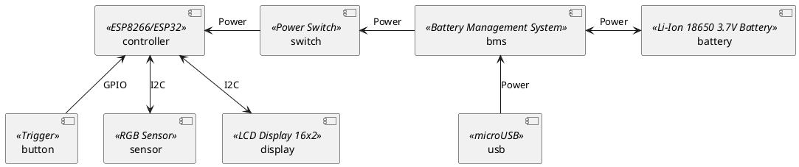
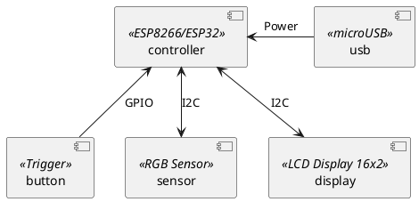

# Quack Hunt Gun Schema

## Variants

### Powered by battery

<!---

```plantuml
@startuml Powered by battery

component controller <<ESP8266/ESP32>>
component button <<Trigger>>
component sensor <<RGB Sensor>>
component display <<LCD Display 16x2>>
component battery <<Li-Ion 18650 3.7V Battery>>
component switch <<Power Switch>>
component bms <<Battery Management System>>
component usb <<microUSB>>

controller <-down- button: GPIO
controller <-down-> sensor: I2C
controller <-down-> display: I2C

controller <-right- switch: Power
switch <-right- bms: Power
bms <-right-> battery: Power
bms <-down- usb: Power

@enduml
```
-->

### Powered by USB

<!-- 

```plantuml
@startuml Powered by USB

component controller <<ESP8266/ESP32>>
component button <<Trigger>>
component sensor <<RGB Sensor>>
component display <<LCD Display 16x2>>
component usb <<microUSB>>

controller <-down- button: GPIO
controller <-down-> sensor: I2C
controller <-down-> display: I2C

controller <-right- usb: Power

@enduml
```
-->

