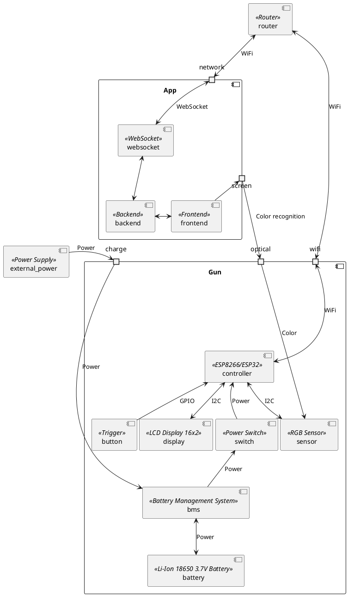
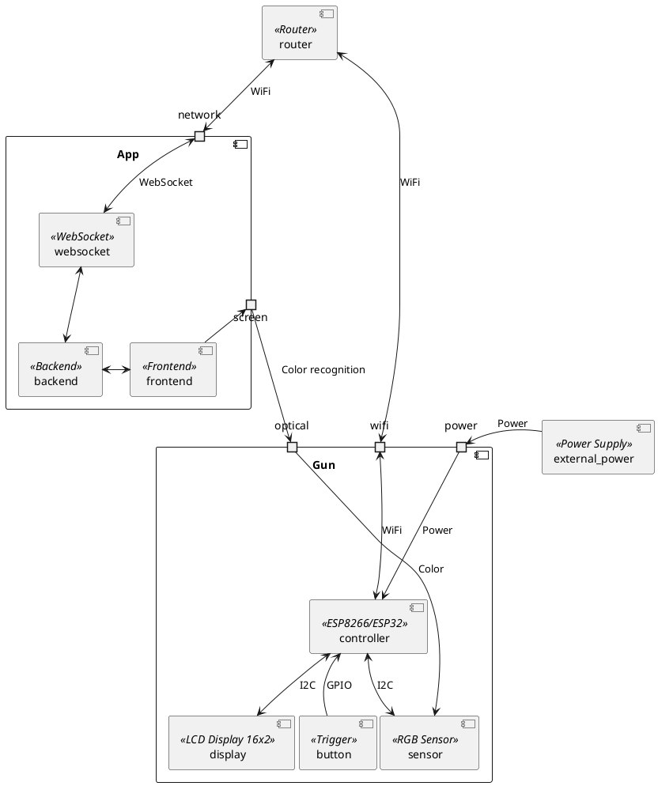

# Quack Hunt Schema

## Variants

### Powered by battery

<!---

```plantuml
@startuml Powered by battery

component external_power <<Power Supply>>

component Gun  {
    component controller <<ESP8266/ESP32>>
    component button <<Trigger>>
    component sensor <<RGB Sensor>>
    component display <<LCD Display 16x2>>
    component battery <<Li-Ion 18650 3.7V Battery>>
    component switch <<Power Switch>>
    component bms <<Battery Management System>>
    portin charge <<Charging Port>>
    port wifi <<WiFi>>
    portin optical <<Optical Port>>
}

external_power -right-> charge: Power
charge -down-> bms: Power

controller <-up-> wifi: WiFi

optical -up-> sensor: Color

controller <-down- button: GPIO
controller <-down-> sensor: I2C
controller <-down-> display: I2C

controller <-down- switch: Power
switch <-down- bms: Power
bms <-down-> battery: Power

component router <<Router>>

router <-down-> wifi: WiFi

component App {
    component websocket <<WebSocket>>
    component frontend <<Frontend>>
    component backend <<Backend>>
    portout screen <<Screen>>
    port network <<Network>>
}

websocket <-up-> network: WebSocket

router <-down-> network: WiFi

websocket <-down-> backend
backend <-left-> frontend

frontend -right-> screen: Screen

screen -down-> optical: Color recognition

@enduml
```
-->

### Powered by USB

<!-- 

```plantuml
@startuml Powered by USB

component external_power <<Power Supply>>

component Gun  {
    component controller <<ESP8266/ESP32>>
    component button <<Trigger>>
    component sensor <<RGB Sensor>>
    component display <<LCD Display 16x2>>
    portin power <<Power Port>>
    port wifi <<WiFi>>
    portin optical <<Optical Port>>
}

external_power -left-> power: Power

controller <-up-> wifi: WiFi

optical -up-> sensor: Color

controller <-down- button: GPIO
controller <-down-> sensor: I2C
controller <-down-> display: I2C

controller <-down- power: Power

component router <<Router>>

router <-down-> wifi: WiFi

component App {
    component websocket <<WebSocket>>
    component frontend <<Frontend>>
    component backend <<Backend>>
    portout screen <<Screen>>
    port network <<Network>>
}

websocket <-up-> network: WebSocket

router <-down-> network: WiFi

websocket <-down-> backend
backend <-left-> frontend

frontend -right-> screen: Screen

screen -down-> optical: Color recognition

@enduml
```
-->

